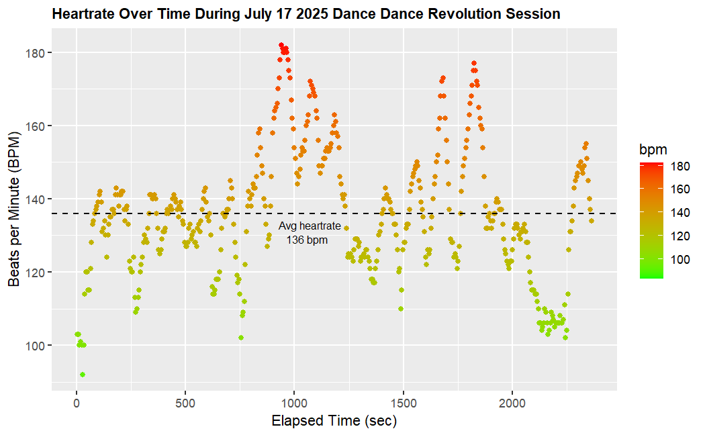
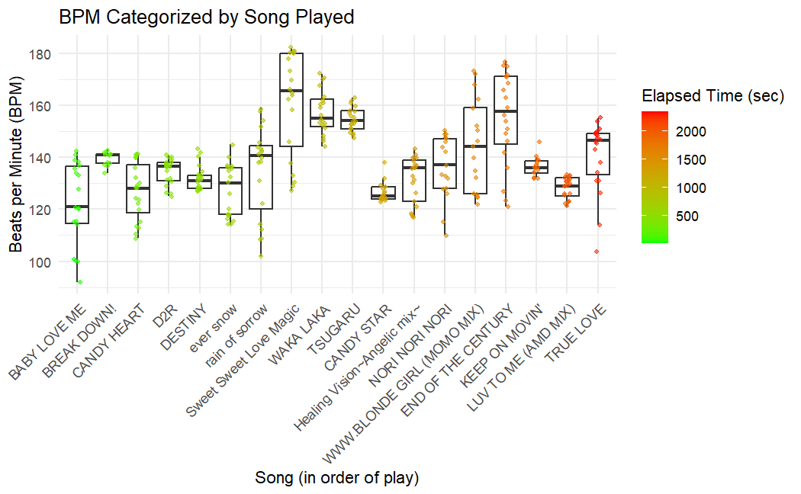

# DDR Step Tracker

A real-time StepMania step + calorie tracker for fitness nerds and rhythm gamers.

Built in Python with:
- Step tracking via keyboard or Dance Pad (I use an L-TEK Prime)
- Heart rate monitoring over Bluetooth
- Calories and session stats (Keytel formula: https://pubmed.ncbi.nlm.nih.gov/15966347/)
- Song performance parsing from StepMania Stats.xml
- JSON session saving for later analysis
- Tkinter GUI with a bold, DDR inspired design

---

## Features

- **Step Tracking** via arrow keys or DDR pad (gamepad or keyboard-mapped)
- **Heart Rate Monitoring** with Bluetooth chest straps (BLE)
- **Calorie Estimation** using weight, age, and HR (Keytel et al.)
- **Automatic Song Logging** from StepMania XML data
- **JSON Session Export** with:
  - Elapsed time
  - BPM series
  - Steps per minute
  - Step quality (flawless, perfect, etc.)
  - Overall and combo accuracy
  - Session songs played
-  **Tkinter GUI** for real-time stats

---

## Requirements

- Python 3.9+
- Tested on Windows 10
- **Required Packages:**
```bash
pip install pygame bleak keyboard
```

## Examples of Tracker Data Plotted in R

### Heartrate Over Time

*Tracks heart rate during the entire play session.*

### Heartrate Grouped by Song

*Shows heart rate variability across different DDR songs.*

## Author

Tyler Pecora — ASU Computational Life Sciences
Former paramedic turned rhythm game nerd and bioinformatician

